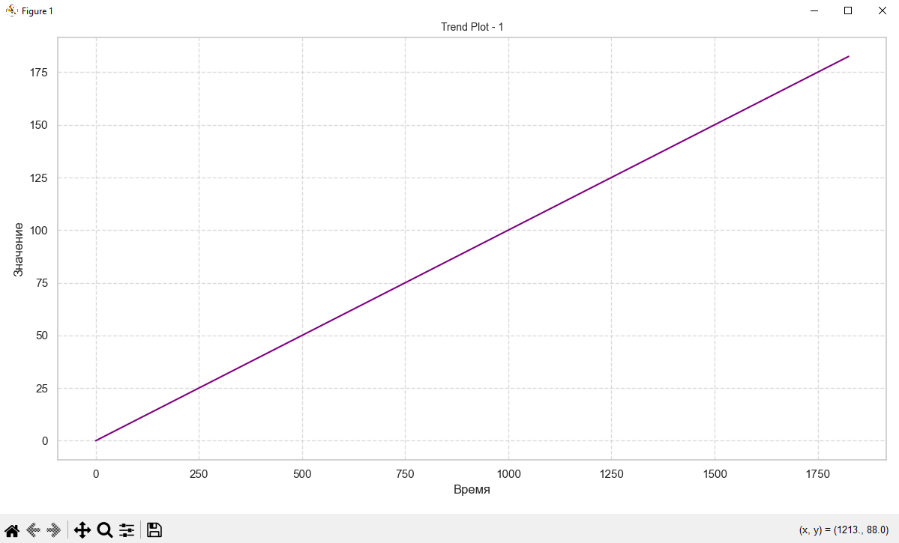

# Визуализация временных рядов с использованием Matplotlib, Seaborn и Plotly

Этот проект создает сложные временные ряды, комбинируя различные компоненты: тренд, сезонность, белый шум, автокорреляцию и пропуски в данных. Для визуализации использованы библиотеки Matplotlib, Seaborn и Plotly, что позволяет генерировать как статичные, так и интерактивные графики. Проект демонстрирует, как эти компоненты могут взаимодействовать друг с другом для создания реалистичных моделей данных.

## Описание

В этом проекте:

- **Matplotlib** используется для создания стандартных графиков.
- **Seaborn** применяется для улучшения визуализации с более эстетичным стилем.
- **Plotly** используется для создания интерактивных графиков, которые можно масштабировать и исследовать в реальном времени.

Проект представлен в формате **Jupyter Notebook**, который можно запустить как в **Jupyter Notebook**, так и в **Google Colab**.

## Требования

Перед запуском кода убедитесь, что у вас установлены следующие библиотеки:

- **`numpy`** — для работы с массивами данных.
- **`matplotlib`** — для создания статичных графиков.
- **`seaborn`** — для улучшения визуализации с помощью стильных графиков.
- **`plotly`** — для создания интерактивных графиков.
- **`statsmodels`** — для анализа временных рядов и построения моделей ARIMA.

Чтобы установить все необходимые библиотеки, выполните следующую команду:

```bash
pip install numpy matplotlib seaborn plotly statsmodels
```
Если вы используете Google Colab, эти библиотеки уже предустановлены.

## Как запустить проект

Запуск в **Google Colab**:

1. Перейдите по следующей ссылке, чтобы открыть проект в **Google Colab**:
    - Открыть в [Google Colab](https://colab.google/)

2. В Google Colab файл откроется, и вы сможете выполнять ячейки, нажимая Shift + Enter.

## Запуск в Jupyter Notebook:

1. Откройте файл **`time_series_visualization.ipynb`** в Jupyter Notebook.

2. Выполните ячейки с кодом по очереди, нажимая Shift + Enter.

Если вы предпочитаете запускать скрипт локально, используйте следующую команду:

```bash
python time_series_plot.py
```
Скрипт создаст графики для различных типов данных и сохранит их в виде изображений.

## Примечания

- Для корректного отображения интерактивных графиков Plotly требуется установленный Jupyter Notebook или интеграция с браузером.
- Для лучшей визуализации в Jupyter Notebook используйте встроенную поддержку Plotly с помощью команды fig.show().

## Структура кода

**Импорт библиотек**

```python
import numpy as np
import matplotlib.pyplot as plt
import seaborn as sns
import plotly.graph_objects as go
from statsmodels.graphics.tsaplots import plot_acf, plot_pacf
from statsmodels.tsa.arima.model import ARIMA
```

- **`numpy`** - используется для работы с числовыми данными.
- **`matplotlib.pyplot`** - отвечает за создание стандартных графиков.
- **`seaborn`** - используется для улучшения визуализации графиков.
- **`plotly.graph_objects`** - предоставляет возможность строить интерактивные графики.
- **`statsmodels`** - необходим для построения автокорреляционных графиков и моделей ARIMA.

## Создание тренда

Для создания линейного тренда используется функция **`trend`**:

```python
def trend(time, slope=0):
    return slope * time
```
Тренд добавляется к основной временной серии с определенным наклоном (положительным или отрицательным).

```markdown

```
